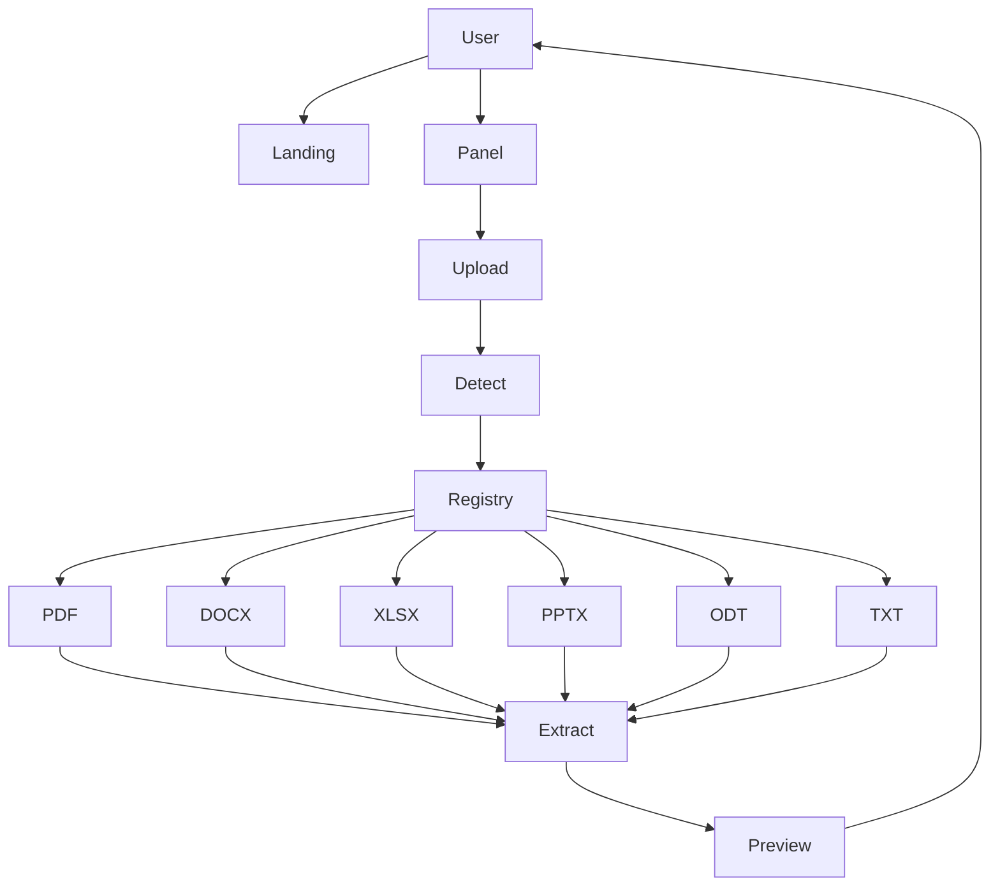

# AGENTS — universal-document-os

## Agents (10)

| # | Agent | File | Role |
|---|-------|------|------|
| 1 | Adapter Registry | app/adapters/__init__.py | Registry @register(FMT) + get_extractor + extract |
| 2 | PDF Extractor | app/adapters/pdf.py | pypdf text extraction |
| 3 | DOCX Extractor | app/adapters/docx.py | python-docx paragraphs |
| 4 | XLSX Extractor | app/adapters/xlsx.py | openpyxl sheets + rows |
| 5 | PPTX Extractor | app/adapters/pptx.py | python-pptx if installed else UnsupportedFormat |
| 6 | ODT Extractor | app/adapters/odt.py | odfpy + zip fallback content.xml |
| 7 | TXT/MD/CSV Extractor | app/adapters/text.py | utf-8 reader |
| 8 | Main API | app/main.py | FastAPI routes + upload + audit |
| 9 | Landing Agent | app/templates/landing.html | Landing page |
| 10 | Panel Agent | app/templates/panel.html | Upload panel |

## Flow



## How to Extend

- Add new format: create app/adapters/newformat.py with @register("NEWFMT") + extract function, add to SUPPORTED_FORMATS
- Add new operation: edit app/main.py /api/process endpoint
- Add test: create tests/test_new.py with pytest

## Testing

```bash
pytest -v
# 19 passed
```

## Env

See .env.example — PORT only, local-first
