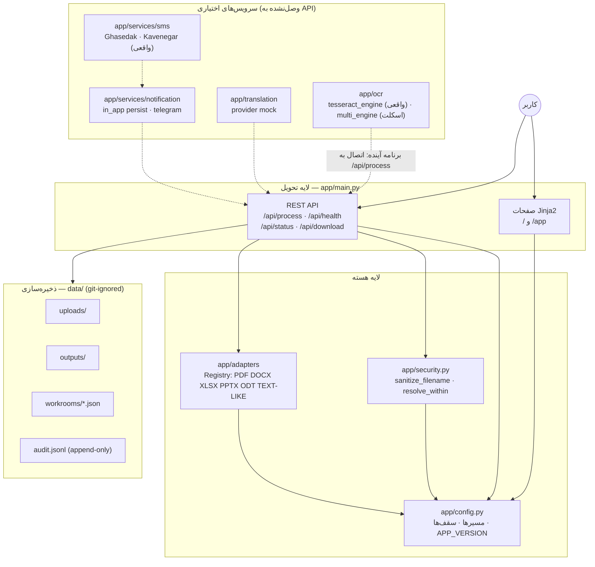
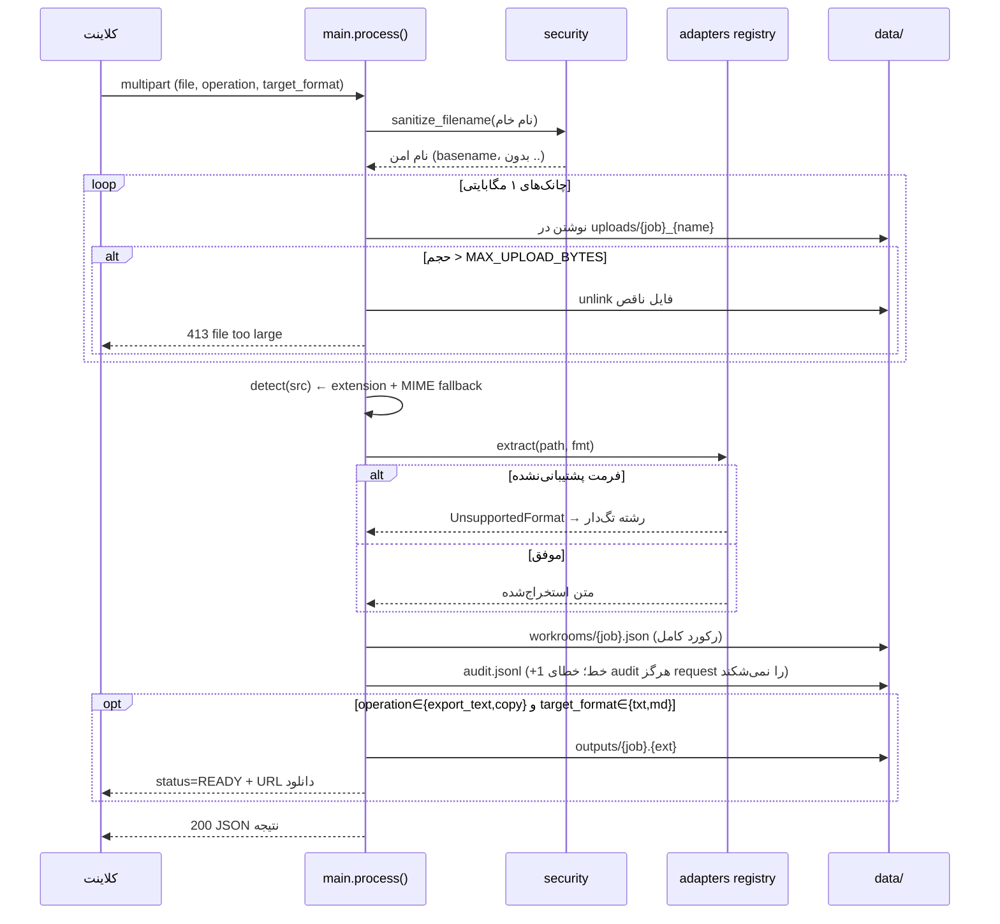

# معماری سیستم — Universal Document OS

**نسخه مستند:** v3.2.4 · هم‌راستا با `APP_VERSION` در `app/config.py`

این سند، معماری واقعی کد را توضیح می‌دهد — همان چیزی که در مخزن اجرا می‌شود، نه آنچه قرار است روزی بشود. برای هر ادعا، فایل مبدأ ذکر شده تا بتوانید راستی‌آزمایی کنید. موارد برنامه‌ریزی‌شده صریحاً با برچسب **«برنامه آینده»** جدا شده‌اند.

---

## فهرست

- [نگاه کلی](#نگاه-کلی)
- [تصمیم‌های بنیادی معماری](#تصمیم‌های-بنیادی-معماری)
- [نقشه کامپوننت‌ها](#نقشه-کامپوننت‌ها)
- [جریان یک درخواست (Sequence)](#جریان-یک-درخواست-sequence)
- [لایه‌ها و مسئولیت هر ماژول](#لایه‌ها-و-مسئولیت-هر-ماژول)
- [الگوی Registry برای فرمت‌ها](#الگوی-registry-برای-فرمت‌ها)
- [مدل داده و ذخیره‌سازی](#مدل-داده-و-ذخیره‌سازی)
- [پیکربندی و رازها](#پیکربندی-و-رازها)
- [زیرساخت داکر](#زیرساخت-داکر)
- [انطباق با ۱۲-Factor](#انطباق-با-۱۲factor)
- [قيدت‌های شناخته‌شده](#قيدت‌های-شناخته‌شده)
- [تصمیم‌های معماری (ADR خلاصه)](#تصمیم‌های-معماری-adr-خلاصه)

---

## نگاه کلی

Universal Document OS یک **سرویس تک‌نهاد (monolith کوچک) محلی‌اول** است:

- یک اپلیکیشن **FastAPI** که هم صفحات وب و هم REST API را از یک پروسه سرو می‌دهد.
- استخراج متن با **رجیستری آداپتور** انجام می‌شود؛ هر فرمت یک تابع ثبت‌شده است.
- تمام حالت (state) روی **فایل‌های ساده داخل `data/`** نگه داشته می‌شود — بدون دیتابیس، بدون صف، بدون سرویس خارجی.
- ایدئولوژی طراحی: «کم اما صادق» — هر شکستی به‌جای کرش، پیام ساخت‌یافته برمی‌گرداند و هر عملیات در audit log ثبت می‌شود.

## تصمیم‌های بنیادی معماری

| # | تصمیم | چرا | کجا |
|---|---|---|---|
| 1 | Local-first، بدون وابستگی ابری | حریم خصوصی؛ آپدیت قطع اینترنت؛ قابل ممیزی بودن | کل پروژه |
| 2 | Registry pattern برای فرمت‌ها | افزودن فرمت = یک تابع + دکوریتور؛ اصل بسته/باز | `app/adapters/__init__.py` |
| 3 | فایل‌سیستم به‌جای DB (فعلاً) | سادگی استقرار و بکاپ؛ حجم داده شخصی کم | `app/config.py`, workrooms |
| 4 | جداسازی امنیتی در ماژول مستقل | مسیر بحرانی sanitize/resolve یک‌جا و تست‌پذیر باشد | `app/security.py` |
| 5 | منبع حقیقت واحد برای config و نسخه | حذف واگرایی README/کد/health | `app/config.py` |
| 6 | خطا هرگز request را نمی‌شکند | خروجی همیشه JSON با تگ `[UNSUPPORTED_FORMAT]`/`[EXTRACTION_ERROR]` | `app/main.py` |

## نقشه کامپوننت‌ها


```mermaid
graph TD
    subgraph Delivery["لایه تحویل — app/main.py"]
        Pages["صفحات Jinja2<br/>/ و /app"]
        API["REST API<br/>/api/process · /api/health<br/>/api/status · /api/download"]
    end

    subgraph Core["لایه هسته"]
        SEC["app/security.py<br/>sanitize_filename · resolve_within"]
        CFG["app/config.py<br/>مسیرها · سقف‌ها · APP_VERSION"]
        ADAPT["app/adapters<br/>Registry: PDF DOCX XLSX PPTX ODT TEXT-LIKE"]
    end

    subgraph Services["سرویس‌های اختیاری (وصل‌نشده به API)"]
        OCR["app/ocr<br/>tesseract_engine (واقعی) · multi_engine (اسکلت)"]
        TR["app/translation<br/>provider mock"]
        SMS["app/services/sms<br/>Ghasedak · Kavenegar (واقعی)"]
        NOTIF["app/services/notification<br/>in_app persist · telegram"]
    end

    subgraph Storage["ذخیره‌سازی — data/ (git-ignored)"]
        UP["uploads/"]
        OUT["outputs/"]
        WR["workrooms/*.json"]
        AUD["audit.jsonl (append-only)"]
    end

    Client((کاربر)) --> Pages
    Client --> API
    API --> SEC
    API --> ADAPT
    API --> Storage
    Pages --> CFG
    API --> CFG
    SEC --> CFG
    ADAPT --> CFG
    OCR -. "برنامه آینده: اتصال به /api/process" .-> API
    TR -.-> API
    SMS -.-> NOTIF
    NOTIF -.-> API
```

## جریان یک درخواست (Sequence)

ترتیب دقیق کار در `POST /api/process`:


```mermaid
sequenceDiagram
    participant C as کلاینت
    participant M as main.process()
    participant S as security
    participant A as adapters registry
    participant D as data/

    C->>M: multipart (file, operation, target_format)
    M->>S: sanitize_filename(نام خام)
    S-->>M: نام امن (basename، بدون ..)
    loop چانک‌های ۱ مگابایتی
        M->>D: نوشتن در uploads/{job}_{name}
        alt حجم > MAX_UPLOAD_BYTES
            M->>D: unlink فایل ناقص
            M-->>C: 413 file too large
        end
    end
    M->>M: detect(src) ← extension + MIME fallback
    M->>A: extract(path, fmt)
    alt فرمت پشتیبانی‌نشده
        A-->>M: UnsupportedFormat → رشته تگ‌دار
    else موفق
        A-->>M: متن استخراج‌شده
    end
    M->>D: workrooms/{job}.json (رکورد کامل)
    M->>D: audit.jsonl (+1 خط؛ خطای audit هرگز request را نمی‌شکند)
    opt operation∈{export_text,copy} و target_format∈{txt,md}
        M->>D: outputs/{job}.{ext}
        M-->>C: status=READY + URL دانلود
    end
    M-->>C: 200 JSON نتیجه
```

## لایه‌ها و مسئولیت هر ماژول

| ماژول | مسئولیت | نکته کلیدی |
|---|---|---|
| `app/main.py` | تمام route‌ها، streaming upload، ضبط workroom و audit | بدون منطق استخراج؛ فقط ارکستراسیون |
| `app/config.py` | مسیرها (`BASE/DATA/UPLOADS/OUTPUTS/WORKROOMS/AUDIT_FILE`)، `MAX_UPLOAD_BYTES`، `PREVIEW_CHARS`، `APP_VERSION` | همه env-driven؛ تست‌ها همین attribute‌ها را monkey-patch می‌کنند |
| `app/security.py` | `sanitize_filename()` و `resolve_within()` | resolve کامل + بررسی containment پس از symlink |
| `app/adapters/__init__.py` | رجیستری فرمت‌ها + پیاده‌سازی همه استخراج‌گرها | `UnsupportedFormat` تمیز؛ fallback متنی برای فرمت ناشناخته |
| `app/ocr/` | موتورهای OCR | `tesseract_engine.py` واقعی (pytesseract/RapidOCR با graceful skip)؛ `multi_engine.py` هنوز mock |
| `app/translation/service.py` | رابط provider + mock + LayoutReconstructor + GoldenBenchmark | خروجی mock با `"mock": true` علامت می‌خورد |
| `app/services/sms/` | آداپتورهای واقعی Ghasedak/Kavenegar + `SmsService` با fallback mock | هزینه تقریبی هر پیامک ~۱۲۰ تومان |
| `app/services/notification/` | سرویس چندکاناله؛ inbox پایدار JSON (سقف ۵۰)؛ Telegram واقعی | کانال email/sms در این سرویس stub است |
| `app/lib/logger.py` | helper لاگ ساخت‌یافته stdout | بدون print در مسیر import |
| `app/templates/`, `app/static/` | landing + panel + CSS/PWA | Jinja cache در داکر روی tmpfs |

## الگوی Registry برای فرمت‌ها

```python
@register("PDF")
def extract_pdf(path: pathlib.Path) -> str: ...
```

- `register(fmt)` تابع استخراج را در `_EXTRACTORS[fmt.upper()]` ثبت می‌کند.
- `extract(path, fmt)` dispatcher است؛ برای `DOC/XLS/PPT/ODS/ODP` پیام تبدیل به فرمت مدرن می‌دهد و برای ناشناخته‌ها تلاش متنی دارد.
- `SUPPORTED_FORMATS` از خود رجیستری مشتق می‌شود — هرگز دستی sync نمی‌شود.
- **افزودن فرمت جدید:** یک تابع + دکوریتور + یک تست. هیچ نقطه دیگری تغییر نمی‌کند.

## مدل داده و ذخیره‌سازی

| موجودیت | شکل | مسیر | عمر |
|---|---|---|---|
| Job / Workroom | JSON با فیلدهای پاسخ `/api/process` | `data/workrooms/{job_id}.json` | تا حذف دستی |
| فایل آپلود | بایت خام با نام `{job_id}_{safe}` | `data/uploads/` | تا حذف دستی |
| خروجی export | `.txt`/`.md` | `data/outputs/{job_id}.ext` | تا حذف دستی |
| Audit | JSONL — یک خط per رویداد `ANALYZE` | `data/audit.jsonl` | append-only |
| Notification inbox | JSON dict کاربر→لیست (≤۵۰) | `runtime/notifications/inbox.json` | persist بین restart |

**قوانین:** هیچ‌وقت `data/` کامیت نمی‌شود (git-ignored). IDها تصادفی‌اند؛ هیچ نام‌گذاری مبتنی بر ورودی کاربر برای مسیرها استفاده نمی‌شود.

## پیکربندی و رازها

- تنها نقطه ورود تنظیمات `app/config.py` است؛ مقدارها از env خوانده می‌شوند (`PORT`, `DATA_DIR`, `MAX_UPLOAD_BYTES`, `PREVIEW_CHARS`, …). جدول کامل در README §Configuration.
- `.env` توسط installer با `chmod 600` ساخته می‌شود و در `.gitignore` است؛ `.env.example` بدون راز واقعی است.
- کلیدهای پرووایدرها (`SMS_API_KEY`, `TELEGRAM_BOT_TOKEN`, …) فقط در runtime خوانده می‌شوند — هیچ hardcoded secret در ریپو نیست (secret-scan صفر).

## زیرساخت داکر

- **Multi-stage build:** مرحله builder با `pip --prefix=/install`، مرحله runner مینیمال با `curl` برای healthcheck.
- **Non-root:** کاربر `appuser` (uid 1001)؛ دایرکتوری‌های `data/` با chown ساخته می‌شوند.
- **HEALTHCHECK** روی `GET /api/health` هر ۳۰ ثانیه.
- **docker-compose:** یک سرویس، `env_file: .env`، کش Jinja روی tmpfs، map پورت `8000:8000`.
- CI هر PR را با ruff + pytest + docker build می‌سنجد.

## انطباق با ۱۲-Factor

| فاکتور | وضعیت | شواهد |
|---|---|---|
| I Codebase | ✅ | یک مخزن، deploy با tag |
| II Dependencies | ✅ | `requirements.txt` پین‌شده، ایزوله در کانتینر |
| III Config | ✅ | همه از env؛ صفر secret در کد |
| IV Backing services | ✅* | فعلاً فایل‌سیستم؛ DB در roadmap |
| V Build/Release/Run | ✅ | multi-stage + tag + compose |
| VI Processes | ✅ | stateless در پروسه؛ حالت روی دیسک |
| VII Port binding | ✅ | `PORT` env، bind 0.0.0.0 |
| VIII Concurrency | ✅ | async FastAPI؛ workers از compose |
| IX Disposability | ⚠️ | start سریع ✓؛ graceful shutdown کامل نشده |
| X Dev/Prod parity | ✅ | همان image، همان compose |
| XI Logs | ✅ | stdout ساخت‌یافته (`app/lib/logger.py`) |
| XII Admin processes | ✅ | `backup.sh` / `status.sh` / one-off exec |

## قیدت‌های شناخته‌شده

صادقانه، به‌ترتيب اهمیت:

1. **بدون احراز هویت** — فقط localhost/شبکه خصوصی. قبل از public شدن، auth الزامی است (roadmap).
2. **OCR/Translation در API فعال نیست** — ماژول‌ها آماده‌اند ولی `/api/process` هنوز فراخوانی‌شان نمی‌کند.
3. **فرمت‌های legacy (DOC/XLS/PPT/ODS/ODP)** شناسایی ولی استخراج نمی‌شوند — راه‌حل برنامه‌ریزی‌شده: تبدیل با LibreOffice headless.
4. **ذخیره JSON-فایلی** — برای بار همزمان بالا یا چند-نودی مناسب نیست؛ مهاجرت به SQLite/Postgres در roadmap.
5. **بدون rate-limit و quota** — در deployment مشترک لازم است.
6. **بدون metrics/tracing** — Prometheus/OpenTelemetry هنوز اضافه نشده.

## تصمیم‌های معماری (ADR خلاصه)

| ADR | وضعیت | خلاصه |
|---|---|---|
| ADR-001 فایل‌سیستم به‌جای DB | پذیرفته (موقت) | سادگی MVP؛ شرط بازنگری: >۱۰k رکورد یا multi-node |
| ADR-002 Registry به‌جای if/else | پذیرفته | گسترش‌پذیری فرمت‌ها بدون touch کردن core |
| ADR-003 امنیت در ماژول مجزا | پذیرفته | تمرکز path-critical در `security.py` با تست اختصاصی |
| ADR-004 خطای استخراج = پاسخ ۲۰۰ تگ‌دار | پذیرفته | client باید `[UNSUPPORTED_FORMAT]` را parse کند؛ tradeoff sاد: status code معنای business ندارد |
| ADR-005 OCR multi-engine با graceful degradation | in-progress | engines واقعی نوشته شدند؛ wiring باقی مانده |

---

*این سند باید با هر PRای که route یا ماژول جدید اضافه می‌کند به‌روز شود — بخشی از [checklist مشارکت](CONTRIBUTING.md).*
