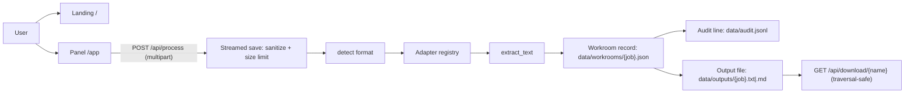

# Universal Document OS

**A local-first document processing platform.** Upload a file, get clean text out — with format detection, per-format extraction adapters, persistent workroom records, and an append-only audit trail. No cloud dependency, no accounts, nothing leaves your machine.

[](https://github.com/ansariaiadmin/universal-document-os/actions/workflows/ci.yml)
[](#testing)
[](#supported-formats)
[](https://www.python.org/)
[](https://fastapi.tiangolo.com/)
[](docker-compose.yml)
[](LICENSE)

**Current version:** v3.2.7 (single source of truth: `APP_VERSION` in [`app/config.py`](app/config.py)).

---

## Table of contents

- [Why this project](#why-this-project)
- [Quick start](#quick-start)
  - [Option A — Docker (recommended for non-developers)](#option-a--docker-recommended-for-non-developers)
  - [Option B — Native Python (recommended for developers)](#option-b--native-python-recommended-for-developers)
- [Supported formats](#supported-formats)
- [How it works](#how-it-works)
- [API reference (summary)](#api-reference-summary)
- [Configuration](#configuration)
- [Operational scripts](#operational-scripts)
- [Testing](#testing)
- [Project structure](#project-structure)
- [Honest scope: what is real today, what is planned](#honest-scope-what-is-real-today-what-is-planned)
- [Documentation map](#documentation-map)

---

## Why this project

Most document tools are either cloud SaaS (your files leave your machine) or fragile one-off scripts. Universal Document OS sits in the middle: **a small, auditable FastAPI service you can run anywhere**, built around three principles:

1. **Local-first.** All data lives under `data/`. No telemetry, no external calls on the core path.
2. **Extensible by design.** Extraction uses a *registry pattern* — adding a format means writing one function and decorating it. Nothing else changes.
3. **Traceable by default.** Every upload becomes a *workroom* record (JSON) plus a line in an append-only audit log (`data/audit.jsonl`). You can always answer "what happened to this file?"

### Who reads what

| If you are… | Start with |
|---|---|
| A non-technical user installing the app | [`INSTALL.md`](INSTALL.md) · [`docs/SETUP-WIZARD-FA.md`](docs/SETUP-WIZARD-FA.md) (فارسی) |
| An end user of the web panel | [`docs/USER_GUIDE_EN.md`](docs/USER_GUIDE_EN.md) · [`docs/USER_GUIDE_FA.md`](docs/USER_GUIDE_FA.md) |
| An API integrator | [`docs/API.md`](docs/API.md) · interactive docs at `/api/docs` once running |
| A developer / AI coding agent | This README → [`ARCHITECTURE.md`](ARCHITECTURE.md) → [`AGENTS.md`](AGENTS.md) → [`CONTRIBUTING.md`](CONTRIBUTING.md) |
| Evaluating security posture | [`SECURITY.md`](SECURITY.md) |

---

## Quick start

### Option A — Docker (recommended for non-developers)

One command, from a clean clone:

```bash
git clone https://github.com/ansariaiadmin/universal-document-os.git
cd universal-document-os
chmod +x install.sh
./install.sh
```

The installer checks prerequisites (Docker, disk, ports), generates a `.env` with safe defaults, builds the image, starts the stack, and waits until the health endpoint responds. Windows users have the equivalent `install.bat`.

When it finishes:

- Landing page: <http://localhost:8000>
- Upload panel: <http://localhost:8000/app>
- Health check: <http://localhost:8000/api/health>

Daily operations use the companion scripts: `./status.sh`, `./logs.sh`, `./stop.sh`, `./start.sh`, `./update.sh`, `./backup.sh` (see [Operational scripts](#operational-scripts)).

### Option B — Native Python (recommended for developers)

```bash
git clone https://github.com/ansariaiadmin/universal-document-os.git
cd universal-document-os
python3 -m venv .venv && source .venv/bin/activate
pip install -r requirements.txt
pytest -q                                   # 29 passed
uvicorn app.main:app --host 0.0.0.0 --port 8000 --reload
```

Same URLs as above. Optional extras for PPTX/ODT are already pinned in `requirements.txt`; if they are missing, the adapters fail *gracefully* with `[UNSUPPORTED_FORMAT]` instead of crashing.

---

## Supported formats

Detection is extension-based with a MIME fallback; extraction dispatches through the adapter registry in [`app/adapters/__init__.py`](app/adapters/__init__.py).

| Format | Status | Notes |
|---|---|---|
| PDF | ✅ Real | `pypdf` text layer (scanned PDFs need OCR — see roadmap) |
| DOCX | ✅ Real | `python-docx` paragraphs |
| XLSX | ✅ Real | `openpyxl`, cell **values** not formulas (`data_only=True`) |
| PPTX | ✅ Real | `python-pptx` shape text |
| ODT | ✅ Real | `odfpy`, with a zero-dependency ZIP/content.xml fallback |
| TXT / MD / CSV / JSON / HTML / RTF | ✅ Real | UTF-8 read with replacement decoding |
| DOC / XLS / PPT / ODS / ODP (legacy) | ⚠️ Detected, not extracted | Clean error message telling you to convert to the modern OOXML/ODF sibling |
| Images (JPG/PNG…) for OCR | 🧪 Module exists, not wired into `/api/process` yet | See [roadmap](ROADMAP.md) |

Unknown extensions fall back to a best-effort text read before giving up.

---

## How it works



Step by step, for one upload:

1. **Receive.** The file streams to `data/uploads/` in 1 MB chunks. The client-supplied filename is sanitized (directory components, `..`, hidden-file names removed; Persian characters preserved), and the request is rejected with `413` if it exceeds `MAX_UPLOAD_BYTES` (default 25 MB).
2. **Detect & extract.** The format registry picks the right adapter. Failures never crash the request — they come back as tagged strings (`[UNSUPPORTED_FORMAT] …`) inside the result.
3. **Record.** A workroom JSON file captures job id, filename, detected format, size, character count, status, and a preview (`PREVIEW_CHARS`, default 5000). One structured line is appended to the audit log.
4. **Export (optional).** With `operation=export_text` (or `copy`) and `target_format=txt|md`, a downloadable file is written to `data/outputs/` and the response includes its URL.
5. **Download safely.** `/api/download/{name}` resolves the path and verifies it stays inside `data/outputs/` after symlink resolution — traversal attempts simply return `404`.

Security-sensitive helpers live in [`app/security.py`](app/security.py); all paths, limits, and the version string live in [`app/config.py`](app/config.py). Tests override those module attributes against a temporary directory, so the real `data/` is never polluted.

---

## API reference (summary)

Full details with curl examples: [`docs/API.md`](docs/API.md). Interactive OpenAPI UI: <http://localhost:8000/api/docs>.

| Method | Endpoint | Purpose |
|---|---|---|
| GET | `/` | Landing page (HTML) |
| GET | `/app` | Upload panel (HTML) |
| POST | `/api/process` | Upload + detect + extract (+ optional export). Form fields: `file`, `operation` (`analyze`\|`export_text`\|`copy`), `target_format` (`same`\|`txt`\|`md`) |
| GET | `/api/health` | Liveness + name + version |
| GET | `/api/status` | Counts of uploads / outputs / workrooms |
| GET | `/api/download/{name}` | Download an exported output (traversal-safe) |

Example:

```bash
curl -X POST http://localhost:8000/api/process \
     -F "file=@sample.pdf" -F "operation=export_text" -F "target_format=md"
```

```json
{
  "job_id": "9f2c…",
  "filename": "sample.pdf",
  "detected_format": "PDF",
  "size_bytes": 48213,
  "characters": 1234,
  "status": "READY",
  "preview": "This is the extracted text…",
  "download": "/api/download/9f2c….md"
}
```

> There is **no authentication** yet — the service is designed to bind to localhost / a private network. Do not expose it publicly until auth lands (tracked in [ROADMAP.md](ROADMAP.md)); see [SECURITY.md](SECURITY.md).

---

## Configuration

Everything is environment-driven; copy `.env.example` to `.env` and edit. Only what you set is read — sensible defaults apply otherwise.

| Variable | Default | Meaning |
|---|---|---|
| `PORT` / `HOST` | `8000` / `0.0.0.0` | Bind address |
| `DATA_DIR` | `./data` | Root for uploads/outputs/workrooms/audit |
| `BASE_DIR` | repo root | Where `DATA_DIR` is resolved against |
| `MAX_UPLOAD_BYTES` | `26214400` (25 MB) | Hard upload ceiling |
| `PREVIEW_CHARS` | `5000` | Preview length stored in workrooms |
| `LOG_LEVEL` | `info` | Logging verbosity |
| `APP_VERSION` | from `app/config.py` | Reported by `/api/health` |
| `OCR_PROVIDER`, `TESSERACT_CMD`, `OCR_LANGS` | see `.env.example` | Used by the OCR engines when wired into the pipeline |
| `SMS_PROVIDER`, `SMS_API_KEY`, `SMTP_*`, `TELEGRAM_*`, `NOTIF_*` | mock/off | Optional notification providers (code present, not yet called from request handlers) |

`.env` is created with `chmod 600` by the installer and is git-ignored. Never commit secrets.

---

## Operational scripts

All first-party, zero-interaction wrappers (identically named `.bat` equivalents exist for Windows):

| Script | What it does |
|---|---|
| `install.sh` | Preflight (Docker/disk/ports) → generate `.env` → build → start → wait for health |
| `update.sh` | Backup → `git pull` → rebuild → restart → verify health, with rollback hint |
| `start.sh` / `stop.sh` | `docker compose up -d` / `down` |
| `status.sh` | Container state, port 8000, provider config summary, disk/memory, health probe |
| `logs.sh` | Tail service logs |
| `backup.sh` | Timestamped copy of `.env` + `data/` into `backups/` (keeps last 7) |
| `smoke-test.sh` | End-to-end probe: health, panel, configured providers (real SMS/Telegram checks only when enabled) |

---

## Testing

```bash
pytest -q          # 29 passed
ruff check app/    # All checks passed!
```

- `tests/conftest.py` redirects every data path to a per-session temp directory — test runs never touch real `data/`.
- `tests/test_security.py` covers path traversal, filename sanitization, the 413 limit, workroom isolation, and version consistency between `/api/health`, the FastAPI app, and `app.config`.
- CI (GitHub Actions) runs ruff + pytest + Docker build on every push/PR.

---

## Project structure

```
app/
  main.py            # FastAPI routes: process, download, health, status, pages
  config.py          # paths, limits, APP_VERSION — single source of truth
  security.py        # sanitize_filename(), resolve_within()
  adapters/          # format registry: PDF/DOCX/XLSX/PPTX/ODT/text-like
  ocr/               # multi-engine scaffold + real tesseract/rapidocr engines
  translation/       # translation/layout/benchmark scaffold (mock providers)
  services/          # sms (ghasedak/kavenegar), notification (persistent inbox)
  lib/logger.py      # structured logging helper
  templates/         # landing.html, panel.html (Jinja2)
  static/            # CSS/PWA assets
data/                # runtime state — git-ignored (uploads/, outputs/, workrooms/, audit.jsonl)
docs/                # API.md, USER_GUIDE_{EN,FA}.md, SETUP-WIZARD-FA.md
tests/               # pytest suite (29 tests) + isolated fixtures
.github/workflows/   # CI: ruff, pytest, docker build
install/update/start/stop/status/logs/backup/smoke-test .sh|.bat
Dockerfile           # multi-stage, non-root, HEALTHCHECK /api/health
docker-compose.yml   # single service, env_file .env, tmpfs Jinja cache
```

---

## Honest scope: what is real today, what is planned

We prefer accurate over impressive. Current state, plainly:

**Real and shipped**
- Upload → detect → extract → workroom → audit → export → download pipeline
- Security hardening: traversal-safe downloads, sanitized filenames, streamed size limits
- Non-root hardened Docker image, CI, 29-test suite
- Real OCR engine implementations (`app/ocr/tesseract_engine.py`: Tesseract via `pytesseract`, RapidOCR via ONNX) that degrade gracefully when binaries/libs are absent

**Scaffolded but not wired into the API yet**
- Multi-engine OCR selection (`app/ocr/multi_engine.py` still returns mock text for paddle/easy engines)
- Translation service and layout reconstruction (mock providers only)
- SMS/email/Telegram notifications (working code, no endpoints call them yet)

**Planned** — see [ROADMAP.md](ROADMAP.md): wiring OCR into `/api/process`, a translation endpoint, authentication before any public deployment, a database-backed store to replace JSON workrooms, and legacy-format conversion via headless LibreOffice.

---

## Documentation map

| File | Audience / content |
|---|---|
| [`INSTALL.md`](INSTALL.md) | Step-by-step install & daily use (Persian, non-technical) |
| [`docs/USER_GUIDE_EN.md`](docs/USER_GUIDE_EN.md) / [`_FA.md`](docs/USER_GUIDE_FA.md) | End-user guide (English / فارسی) |
| [`docs/API.md`](docs/API.md) | Every endpoint with examples, providers, cost notes |
| [`ARCHITECTURE.md`](ARCHITECTURE.md) | Component graph, patterns, 12-factor mapping |
| [`AGENTS.md`](AGENTS.md) | Contributor/agent handoff: where things live, how to extend |
| [`CONTRIBUTING.md`](CONTRIBUTING.md) | Dev setup, style rules, PR checklist |
| [`SECURITY.md`](SECURITY.md) | Vulnerability reporting, hardening practices |
| [`CHANGELOG.md`](CHANGELOG.md) | Release history (SemVer) |
| [`ROADMAP.md`](ROADMAP.md) | Done vs. planned, honestly scoped |

---

## License

MIT — see [LICENSE](LICENSE). Copyright © 2026 **[Mohammad Ansari](https://github.com/ansariaiadmin)**. You are free to use, copy, modify, and redistribute this project under the MIT license — please keep the copyright notice intact.
