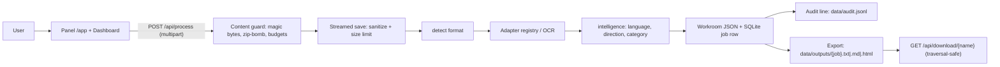

# Universal Document OS

**A local-first document processing platform.** Upload a file, get clean text out — with format detection, per-format extraction adapters, persistent workroom records, an append-only audit trail, and a **live smart dashboard**. No cloud dependency, no accounts, nothing leaves your machine.

[](https://github.com/ansariaiadmin/universal-document-os/actions/workflows/ci.yml)
[](#testing)
[](#supported-formats)
[](https://www.python.org/)
[](https://fastapi.tiangolo.com/)
[](docker-compose.yml)
[](LICENSE)

**Current version:** v4.2.0 (single source of truth: `APP_VERSION` in [`app/config.py`](app/config.py)).

---

## Table of contents

- [Why this project](#why-this-project)
- [Smart dashboard](#smart-dashboard)
- [Quick start](#quick-start)
- [Supported formats](#supported-formats)
- [How it works](#how-it-works)
- [API reference (summary)](#api-reference-summary)
- [Configuration](#configuration)
- [Operational scripts](#operational-scripts)
- [Testing](#testing)
- [Project structure](#project-structure)
- [Honest scope: what is real today, what is planned](#honest-scope-what-is-real-today-what-is-planned)
- [Documentation map](#documentation-map)

---

## Why this project

Most document tools are either cloud SaaS (your files leave your machine) or fragile one-off scripts. Universal Document OS sits in the middle: **a small, auditable FastAPI service you can run anywhere**, built around three principles:

1. **Local-first.** All data lives under `data/`. No telemetry, no external calls on the core path.
2. **Extensible by design.** Extraction uses a *registry pattern* — adding a format means writing one function and decorating it. Nothing else changes.
3. **Traceable by default.** Every upload becomes a *workroom* record (JSON), a row in the SQLite job store, and a line in an append-only audit log (`data/audit.jsonl`). You can always answer "what happened to this file?"

## Smart dashboard

Open the panel at `/app` and click the **Dashboard** icon in the activity bar. It renders live data from `GET /api/dashboard` — every value is **measured at request time**, never fabricated:

- version, uptime, job counters from the live SQLite store
- **real OCR engine probes** (`tesseract` / `rapidocr` — usable right now? yes/no)
- real conversion matrix (from the same gate the API enforces)
- storage counters (uploads/outputs/workrooms + bytes, audit lines)
- security posture (auth on/off, rate limit, upload ceiling)
- honest "what to fix next" hints (e.g. OCR missing → install tesseract; no auth → set `UDO_API_KEYS`)

## Quick start

### Option A — Docker (recommended for non-developers)

```bash
git clone https://github.com/ansariaiadmin/universal-document-os.git
cd universal-document-os
chmod +x install.sh
./install.sh
```

The installer checks prerequisites (Docker, disk, port), creates `.env` from `.env.example`, builds the image, starts the stack, and waits until the health endpoint responds. Windows users have the equivalent `install.bat`. **The Docker image ships the Tesseract binary with English + Persian (`fas`) language data — OCR for images works out of the box.**

When it finishes:

- Landing page: <http://localhost:8000>
- Panel + smart dashboard: <http://localhost:8000/app>
- Health check: <http://localhost:8000/api/health>

### Option B — Native Python (recommended for developers)

```bash
git clone https://github.com/ansariaiadmin/universal-document-os.git
cd universal-document-os
python3 -m venv .venv && source .venv/bin/activate
pip install -r requirements.txt
pytest -q                                   # 89 passed
uvicorn app.main:app --host 0.0.0.0 --port 8000 --reload
```

Native runs need the OCR binary separately (`apt-get install tesseract-ocr tesseract-ocr-fas`) — without it, image uploads return a clean `[UNSUPPORTED_FORMAT] IMAGE` instead of crashing; everything else works normally.

---

## Supported formats

Detection is extension-based with a MIME fallback; extraction dispatches through the adapter registry in [`app/adapters/__init__.py`](app/adapters/__init__.py).

| Format | Status | Notes |
|---|---|---|
| PDF | ✅ Real | `pypdf` text layer (scanned PDFs need OCR of rendered pages — see roadmap) |
| DOCX | ✅ Real | `python-docx` paragraphs |
| XLSX | ✅ Real | `openpyxl`, cell **values** not formulas (`data_only=True`) |
| PPTX | ✅ Real | `python-pptx` shape text |
| ODT / ODS / ODP | ✅ Real | parsed with the **stdlib** (zipfile + ElementTree) — no extra dependency |
| TXT / MD / CSV / JSON / HTML / RTF | ✅ Real | UTF-8 read with replacement decoding, size-bounded |
| DOC (legacy) | ⚠️ Real via `antiword` | needs the `antiword` binary; otherwise an actionable error telling you to install it or convert |
| XLS / PPT (legacy) | ⚠️ Detected, not extracted | clean message telling you to convert to the OOXML sibling |
| Images (JPG/PNG/WEBP/TIFF…) | ✅ Real OCR | multi-engine: Tesseract (binary) → RapidOCR (ONNX, pip-installable). Without any engine: honest `[UNSUPPORTED_FORMAT] IMAGE` with install hints |

Every text-producing adapter is bounded by `MAX_EXTRACT_BYTES` / `MAX_TEXT_CHARS` — a 25 MB upload can never expand into unbounded memory. Unknown extensions are rejected with a clean 415 by the content guard (no silent binary-as-text fallback).

---

## How it works



1. **Receive.** Streamed to `data/uploads/` in 1 MB chunks; sanitized filename; `413` above `MAX_UPLOAD_BYTES` (25 MB).
2. **Guard.** Magic-byte verification (MZ/ELF/shebang renamed to `.pdf` are hard-rejected with `415`), zip-bomb budget, extension-vs-content cross-check.
3. **Extract.** Adapter registry — including real OCR for images. Errors become tagged strings, never 5xx.
4. **Intelligence.** Script-aware language detection (fa/ar/he/zh/ru + Latin stopword scoring), direction, document category, word/line counts — returned in the `intelligence` field.
5. **Record.** Workroom JSON + a durable row in `data/jobs.db` (SQLite, WAL) + one audit line.
6. **Export / convert.** `target_format=txt|md` from any source; styled **HTML** from markdown sources. Unsupported pairs → clean `400`.
7. **Download safely.** `/api/download/{name}` resolves symlinks and enforces containment — traversal attempts get a uniform `404`.

---

## API reference (summary)

Full details with curl examples: [`docs/API.md`](docs/API.md). Interactive OpenAPI UI: <http://localhost:8000/api/docs>.

| Method | Endpoint | Purpose |
|---|---|---|
| GET | `/` | Landing page (HTML) |
| GET | `/app` | Upload panel + smart dashboard (HTML) |
| POST | `/api/process` | Upload + guard + extract (+ optional export). Form fields: `file`, `operation` (`analyze`\|`export_text`\|`copy`\|`convert`), `target_format` (`same`\|`txt`\|`md`\|`html`) |
| GET | `/api/dashboard` | Smart dashboard feed (live facts) |
| GET | `/api/health` | Liveness + name + version |
| GET | `/api/status` | Counters + runtime facts (uptime, features) |
| GET | `/api/job/{id}` | Poll one job (durable store + disk fallback) |
| GET | `/api/jobs` | Newest-first job index (capped at 50) |
| GET | `/api/download/{name}` | Download an exported output (traversal-safe) |
| GET | `/metrics` | Prometheus exposition (never 500s) |
| GET | `/manifest.webmanifest`, `/sw.js`, `/icon-{192,512}.png` | PWA surface |

Optional guards: set `UDO_API_KEYS=key1,key2` → all `/api/*` (except health/docs) require `X-API-Key` (timing-safe comparison). Set `RATE_LIMIT_PER_MIN=60` → sliding-window limit on counted endpoints.

> With no keys configured there is **no authentication** — the service is designed to bind to localhost / a private network. Do not expose it publicly without enabling auth; see [SECURITY.md](SECURITY.md).

---

## Configuration

Everything is environment-driven; copy `.env.example` to `.env` and edit. Only what you set is read — sensible defaults apply otherwise. Every variable below is actually read by the code.

| Variable | Default | Meaning |
|---|---|---|
| `PORT` | `8000` | Host port mapping (container always binds 8000) |
| `DATA_DIR` | `./data` | Root for uploads/outputs/workrooms/audit/jobs.db |
| `MAX_UPLOAD_BYTES` | `26214400` (25 MB) | Hard upload ceiling |
| `MAX_EXTRACT_BYTES` | `67108864` (64 MB) | Decompression/extraction budget |
| `MAX_TEXT_CHARS` | `2000000` | Extracted-text character ceiling |
| `PREVIEW_CHARS` | `5000` | Preview length stored in workrooms |
| `JOB_TTL_SECONDS` | `3600` | Finished jobs older than this are swept |
| `UDO_API_KEYS` | empty (auth off) | Comma-separated API keys → X-API-Key required |
| `RATE_LIMIT_PER_MIN` | `0` (off) | Sliding-window limit per client per minute |
| `OCR_ENGINES` / `OCR_LANGS` / `TESSERACT_CMD` | `tesseract,rapidocr` / `eng+fas` / empty | OCR engine priority, languages, binary path |
| `SMS_PROVIDER`, `SMS_API_KEY`, `TELEGRAM_*`, `NOTIF_*` | mock/off | Optional providers (adapters exist; not called from request handlers yet) |
| `LOG_LEVEL` | `INFO` | Logging verbosity (JSON logs) |

`.env` is created with `chmod 600` by the installer and is git-ignored. Never commit secrets.

---

## Operational scripts

All first-party wrappers (identically named `.bat` equivalents exist for Windows):

| Script | What it does |
|---|---|
| `install.sh` | Preflight (Docker/disk/port) → `.env` from `.env.example` (600) → build → start → wait for health |
| `update.sh` | Backup → `git pull --ff-only` → rebuild → restart → verify health |
| `start.sh` / `stop.sh` | `docker compose up -d` / `down` |
| `status.sh` | Container state, port 8000, `.env` posture (auth/rate-limit on?), live `/api/status`, disk/memory |
| `logs.sh` | Tail service logs |
| `backup.sh` | Timestamped archive of **all of `data/`** (uploads, outputs, workrooms, audit, jobs.db) + a **secrets-redacted** settings snapshot; optional AES-256 passphrase encryption (`BACKUP_ENCRYPT=1`); keeps last 7 |
| `smoke-test.sh` | End-to-end: health, pages, dashboard, a **real upload→extract→export→download round-trip**, OCR binary check |

---

## Testing

```bash
pytest -q          # 89 passed
ruff check .       # All checks passed!
```

- `tests/conftest.py` redirects every data path to a per-session temp directory — test runs never touch real `data/`.
- `tests/test_security.py` covers path traversal, filename sanitization, the 413 limit, workroom isolation, and version consistency.
- `tests/test_v43.py` covers the smart dashboard shape, timing-safe auth, real PWA artifacts (valid PNG magic bytes), honest intelligence (Arabic ≠ Persian), and the refusal of the benchmark to fabricate numbers.
- CI (GitHub Actions) runs ruff + pytest + Docker build on every push/PR; tool versions are pinned in `requirements.txt`.

---

## Project structure

```
app/
  main.py            # routes: process, download, dashboard, jobs, health, status, metrics, PWA
  config.py          # paths, limits, APP_VERSION — single source of truth
  security.py        # sanitize_filename(), resolve_within()
  auth.py            # opt-in X-API-Key guard (timing-safe)
  ratelimit.py       # opt-in sliding-window limiter
  content_guard.py   # magic bytes, zip-bomb, extension/content cross-check
  intelligence.py    # language/direction/category detection (pure stdlib)
  converter.py       # txt/md/html conversion engine with an honest gate
  jobs.py            # durable SQLite job store (WAL, TTL sweep)
  adapters/          # format registry: PDF/DOCX/XLSX/PPTX/ODT/text-like + legacy
  ocr/               # multi-engine OCR: tesseract + rapidocr, real availability probes
  templates/         # landing.html, panel_vscode.html (with smart dashboard)
  static/            # VS Code-style panel CSS
data/                # runtime state — git-ignored (uploads/, outputs/, workrooms/, audit.jsonl, jobs.db)
docs/                # API.md, USER_GUIDE_{EN,FA}.md, SETUP-WIZARD-FA.md
tests/               # pytest suite (89 tests) + isolated fixtures
.github/workflows/   # CI: ruff, pytest, docker build
install/update/start/stop/status/logs/backup/smoke-test .sh|.bat
Dockerfile           # multi-stage, non-root, tesseract+fas, HEALTHCHECK /api/health
docker-compose.yml   # single service, opt-in env_file, port mapping
```

---

## Honest scope: what is real today, what is planned

We prefer accurate over impressive. Current state, plainly:

**Real and shipped**
- Upload → guard → extract → intelligence → workroom → audit → export → download pipeline
- Smart dashboard with live, measured facts (`/api/dashboard` + panel tab)
- Real OCR for images (Tesseract binary shipped in the Docker image with `eng+fas`; RapidOCR as a pip-installable fallback)
- Real DOC extraction via `antiword` when the binary is present; actionable error otherwise
- Opt-in API-key auth (timing-safe) and rate limiting; durable SQLite job store; Prometheus metrics
- Real PWA surface: served web manifest, generated PNG icons, service worker
- Security hardening: traversal-safe downloads, sanitized filenames, size ceilings, magic-byte guard, zip-bomb budget

**Scaffolded but not wired into the API yet**
- Translation service (mock provider only — clearly flagged `"mock": true`)
- SMS/Telegram/email notifications (working adapters; no request handler calls them yet)

**Planned** — see [ROADMAP.md](ROADMAP.md): translation endpoint, notification wiring from the API path, a ground-truth dataset for a real quality benchmark, database migration for workrooms, and legacy XLS/PPT conversion via headless LibreOffice.

---

## Documentation map

| File | Audience / content |
|---|---|
| [`INSTALL.md`](INSTALL.md) | Step-by-step install & daily use (Persian, non-technical) |
| [`docs/USER_GUIDE_EN.md`](docs/USER_GUIDE_EN.md) / [`_FA.md`](docs/USER_GUIDE_FA.md) | End-user guide (English / فارسی) |
| [`docs/API.md`](docs/API.md) | Every endpoint with examples |
| [`ARCHITECTURE.md`](ARCHITECTURE.md) | Component graph, patterns, 12-factor mapping |
| [`AGENTS.md`](AGENTS.md) | Contributor/agent handoff: where things live, how to extend |
| [`CONTRIBUTING.md`](CONTRIBUTING.md) | Dev setup, style rules, PR checklist |
| [`SECURITY.md`](SECURITY.md) | Vulnerability reporting, hardening practices |
| [`CHANGELOG.md`](CHANGELOG.md) | Release history (SemVer) |
| [`ROADMAP.md`](ROADMAP.md) | Done vs. planned, honestly scoped |

---

## License

MIT — see [LICENSE](LICENSE). Copyright © 2026 **[Mohammad Ansari](https://github.com/ansariaiadmin)**. You are free to use, copy, modify, and redistribute this project under the MIT license — please keep the copyright notice intact.
